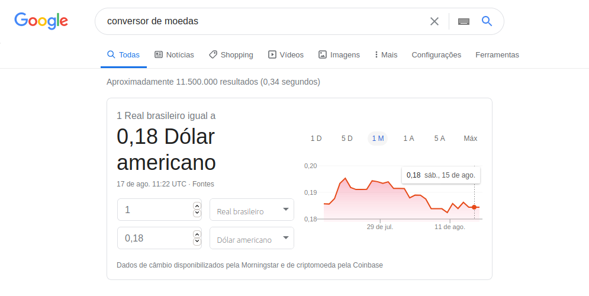

<h1 align="center">
Conversor de moedas
</h1>

  
  
  

## :telescope: Visão Geral
Projeto estudo da construção de um robô que faz a conversão monetária em cima da API do Puppeteer fazendo uma busca no Google, conforme tutorial do [Dev Soltinho](https://youtu.be/4W55nFDyIrc).

## :computer: Tecnologias
  
- [Javascritp](https://www.javascript.com/)
- [NodeJs](https://nodejs.org/en/)

## :sparkles: Dependências
  
- [Puppeteer](https://github.com/puppeteer/puppeteer.git)
- [Readline-sync](https://github.com/anseki/readline-sync.git)

## :bow: Author

* Email: nlnadialigia@gmail.com
* GitHub: [@nlnadialigia](https://github.com/nlnadialigia)
* LinkedIn: [@nlnadialigia](https://linkedin.com/in/nlnadialigia)

---
Copyright © 2020 💖 Nadia Ligia
